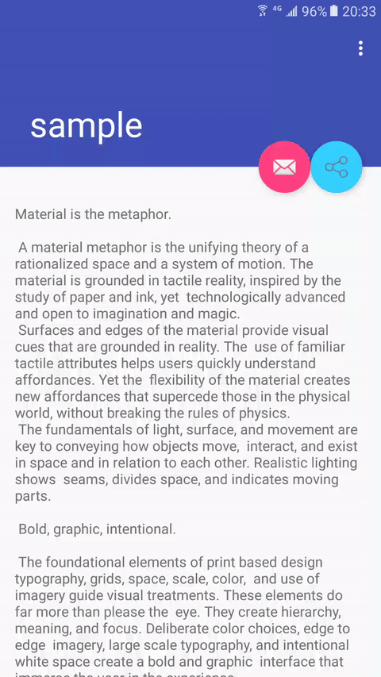
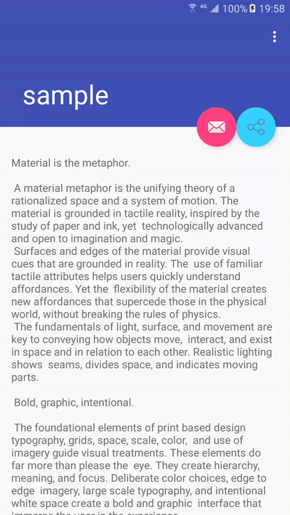

# ActSwitchAnimTool

---

As well as we know, Android 5.0 has been support more Animation(just like ViewAnimationUtils~). Maybe some developers can implements the same effect in other way，but it too tedious to implements the same many times in various needs. It's time to build a wheel to solve the problem. ActSwitchAnimTool can compat the version of Android 4.0 or above. And it's convenient to use.

Demo:

</img>
</img>


## Installation

Step 1. Add it in your root build.gradle at the end of repositories.

```java
allprojects {
	repositories {
		...
		maven { url "https://jitpack.io" }
	}
}
```
Step 2. Add the dependency

```java
dependencies {
    ...
    compile 'com.github.Yellow5A5:ActSwitchAnimTool:1.0.0'
}
```

## Usage

### ● SPREAD_MODE

#### 1.Keep the first activity.

You can set the second parameter of *ActSwitchAnimTool.startActivity* to keep the FirstActivity. If you want keep it and show the shrink-Animation, you must take the method of *setShrinkBack(true)*.

```java
Intent intent = new Intent(FirstActivity.this, SecondActivity.class);
mFirstDemoActSwitchAnimTool = new ActSwitchAnimTool(FirstActivity.this).setAnimType(ActSwitchAnimTool.MODE_SPREAD)
        .target(mActSwitchDemoBtn)
        .setShrinkBack(true)
        .setmColorStart(Color.parseColor("#FF5777"))
        .setmColorEnd(Color.parseColor("#FF5777"))
        .startActivity(intent, false);
```
it will not really startActivity until you take the method of *build()*.

```java
mFirstDemoActSwitchAnimTool.setAnimType(ActSwitchAnimTool.MODE_SPREAD)
		.build();
```

#### 2.Do not keep the first activity.

if you don't need keep the first activity, you can take the method more clearly like this.

```java
new ActSwitchAnimTool(FirstActivity.this).setAnimType(ActSwitchAnimTool.MODE_SPREAD)
        .target(mActSwitchDemoBtn)
        .setmColorStart(Color.parseColor("#FF5777"))
        .setmColorEnd(Color.parseColor("#FF5777"))
        .startActivity(intent, true)
        .build();
```

### ● SHRINK_MODE

Place this code in Second Activity to receive the message.

```java
new ActSwitchAnimTool(this)
        .receiveIntent(getIntent())
        .setAnimType(ActSwitchAnimTool.MODE_SHRINK)
        .target(mDemoFloatingBtn)
        .build();
```

### ● Other 

#### ◦ CustomCallback

You can set the custom callback like this, but it is in conflict with *startActivity*. You can change it inside if you want.(I set it at the method of KeyUp(event=keyback) in second Activity. The Animation will appear when I click back.). 

```java
new ActSwitchAnimTool(this)
        .setAnimType(ActSwitchAnimTool.MODE_SPREAD)
        .target(mDemoFloatingBtn)
        .setmColorStart(Color.parseColor("#FF5777"))
        .setmColorEnd(Color.parseColor("#FF5777"))
        .setCustomEndCallBack(new ActSwitchAnimTool.SwitchAnimCallback() {
            @Override
            public void onAnimationStart() {
            }

            @Override
            public void onAnimationEnd() {
                finish();
            }

            @Override
            public void onAnimationUpdate(int progress) {

            }
        })
        .build();
```


#### ◦ AddContainer !

Take your custom view in here, to implements the effect you wanted.

```java
        mShareContainer = new ShareContainer(FirstActivity.this);
        mShareContainer.setIShareCallback(new ShareContainer.IShareCallback() {
            @Override
            public void onCancel() {
                mShareContainer.hideShareBtn();
                shareDemoTool.setAnimType(ActSwitchAnimTool.MODE_SHRINK)
                        .removeContainerView(mShareContainer)
                        .build();
            }
        });
        mShareViewDemoBtn.setOnClickListener(new View.OnClickListener() {
            @Override
            public void onClick(View v) {
                shareDemoTool.setAnimType(ActSwitchAnimTool.MODE_SPREAD)
                        .addContainerView(mShareContainer, new ActSwitchAnimTool.SwitchAnimCallback() {
                            @Override
                            public void onAnimationStart() {

                            }

                            @Override
                            public void onAnimationEnd() {
                                mShareContainer.showShareBtn();
                            }

                            @Override
                            public void onAnimationUpdate(int progress) {

                            }
                        }).
                        build();
            }
        });
```


## Demo－Introduction

I have implemented the **ShareContainer**.This design is a reference to the idea of [Social share](https://ios.uplabs.com/posts/social-share-734184f5-822e-4e59-bf44-a713c4595dc0) by Ронжин Михаил.You can easy to implements it by the *AddContainer*;


</img>


## License

    Copyright 2016 Yellow5A5
    
    Licensed under the Apache License, Version 2.0 (the "License");
    you may not use this file except in compliance with the License.
    You may obtain a copy of the License at
    
        http://www.apache.org/licenses/LICENSE-2.0
    
    Unless required by applicable law or agreed to in writing, software
    distributed under the License is distributed on an "AS IS" BASIS,
    WITHOUT WARRANTIES OR CONDITIONS OF ANY KIND, either express or implied.
    See the License for the specific language governing permissions and
    limitations under the License.

